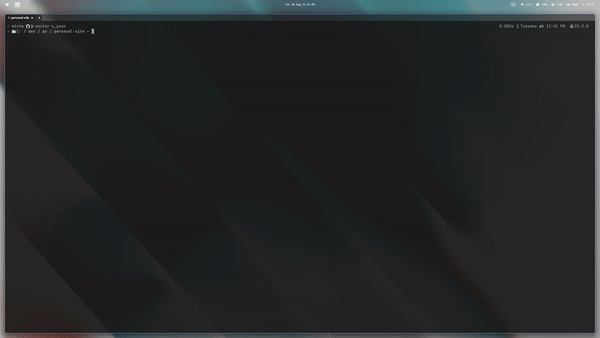

# My Nvim Config

A very simple Neovim configuration.




## File Structure

All plugins are located in `/lua/plugins/`. **Lazy.nvim** automatically picks up on the directory and loads them.

## Credit

Very very special thanks to [typecraft](https://www.youtube.com/@typecraft_dev) for the amazing series on YouTube!

```rust
fn main() {
		println!("hello, World!")
	}
```

```go
func main() {
    fmt.Println("hello, world!")
}
```


$$
f(x) = \int_{0}^{x} x^{2}(\frac{3}{\sqrt{6}})
$$

<br>
<br>
<br>
<br>
<br>
<br>
<br>
<br>
<br>
<br>
<br>
<br>
<br>
<br>
<br>
<br>
<br>
<br>
<br>
<br>
<br>
