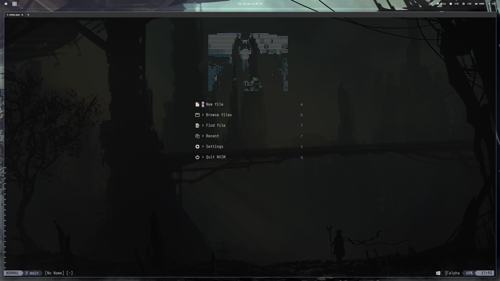

# My Nvim Config

A very simple Neovim configuration.

_These preview are outdated, it looks better now_

## File Structure

All plugins are located in `/lua/plugins/`. **Lazy.nvim** automatically picks up on the directory and loads them.

## Credit

Very very special thanks to [typecraft](https://www.youtube.com/@typecraft_dev) for the amazing series on YouTube!
