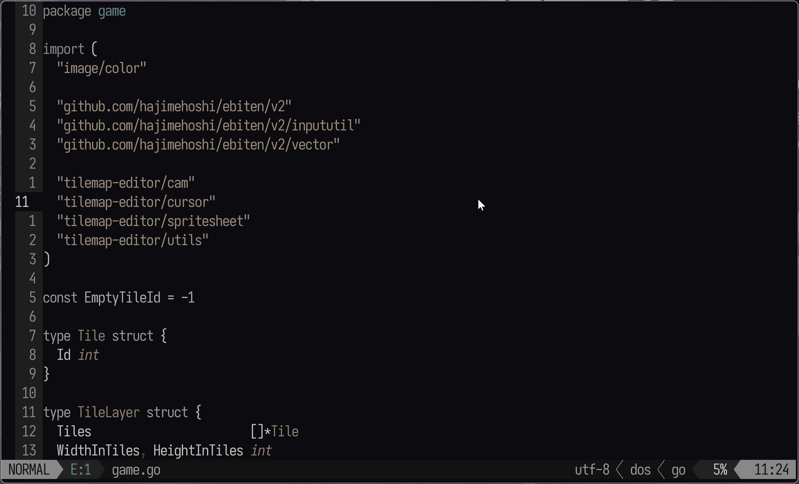

# ezdiagnostics.nvim

A small plugin that provides a jump table for diagnostics on the active buffer.



## Installation

### Lazy.nvim

```lua
return {
  "m1chaelwilliams/ezdiagnostics",
    config = function()
      require("ezdiagnostics").setup({
        cmd = "<leader>ld",
          width = 60,
          margin = 2,
      })
    end,
}
```
